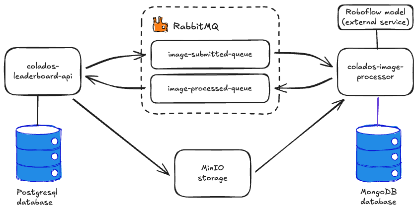

# Colados Leaderboard
A project to register Mario Kart scores either manually or by processing uploaded scoreboard photos. Generates monthly leaderboards.

## Project Features
- Manual score entry
- Photo upload and processing for score extraction (using Roboflow model)
- Monthly leaderboard generation
- User authentication (Google) and profile management

## Project components and architecture

### Project components

This repository has 2 applications:
1. **API** (colados-leaderboard-api): For submitting scores and photos and generating leaderboards.
2. **Image Processor** (colados-image-processor): Submits uploaded scoreboard photos to Roboflow model for score extraction.

The project also depends on other services that are deployed using the (docker-compose)[./docker-compose.yml] file:

- **API database**: PostgreSQL database for storing user profiles, scores, and leaderboards. Used by the API.
- **Image Processor database**: MongoDB database for storing image processing results. Used by the Image Processor.
- **RabbitMQ**: Message broker for communication between the API and Image Processor. Used by both applications.
- **MinIO**: Object storage for storing uploaded scoreboard photos. Used by both applications.

### Project architecture

The following diagram illustrates the architecture of the Colados Leaderboard project:



## Development Setup

1. Clone the repository:
```bash
git clone https://github.com/andrecaiado/colados-leaderboard.git
```

2. Follow the instructions in each application's README to set up their development environments:
   - [API README](./colados-leaderboard-api/README.md)
   - [Image Processor README](./colados-image-processor/README.md)

## Running the Complete Project

Before running the applications, ensure you have the following prerequisites:

- Docker
- Docker Compose

Steps to run and test the applications:

1. Update the environment variables in the [.env](./.env) file as needed.

2. Start the services using Docker Compose:

```bash
docker-compose up
```

3. Access the API swagger UI to run the endpoints:

- Available at `http://localhost:8080/swagger-ui/index.html`

4. Refer to the [API Guide](./colados-leaderboard-api/README.md#api-guide) for detailed instructions on how to use the API endpoints.
